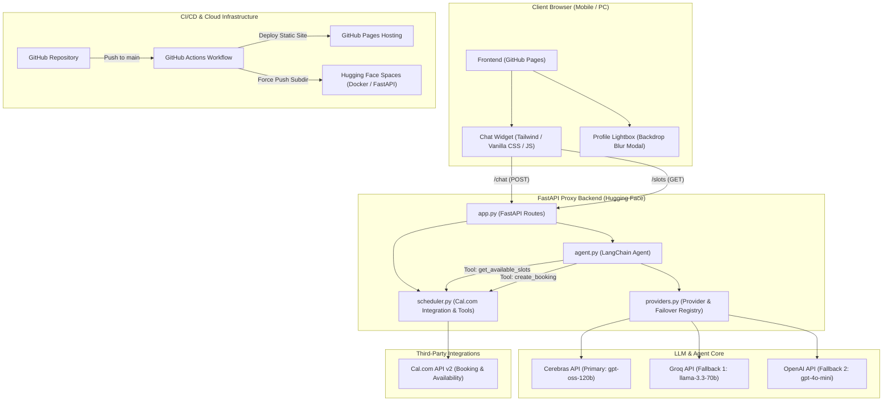

# Rahul J Hirur - Portfolio Architecture & Technical Stack

Comprehensive documentation of the full-stack architecture, technical implementations, and integration strategies utilized in the portfolio website and its AI agent chatbot widget.

---

## 1. System Architecture Overview

The system utilizes a decoupled, modern serverless-style architecture optimized for speed, reliability, and security:
* **Frontend**: Hosted on **GitHub Pages** (fast static content delivery, HTTPS out-of-the-box).
* **Backend**: Hosted on **Hugging Face Spaces** as a Dockerized FastAPI proxy (bypasses CORS restrictions, secures API keys, manages LLM orchestration).
* **AI Core**: Driven by a **LangChain/LangGraph agent** with dynamic, multi-provider failover.

### Architecture Diagram



---

## 2. Technical Stack Breakdown

### A. The Frontend (Client Browser)
* **Core Tech**: HTML5, Vanilla JavaScript, CSS3, Tailwind CSS (loaded via CDN for layout styling).
* **Interactive UI Elements**:
  * **Smooth Scroll-Spy Links**: Monitors page scroll positioning to dynamically highlight active navigation links.
  * **Swipeable horizontal tracks**: Interactive tracks for Skills and Projects with inertia-dragging and touch/click scroll buttons.
  * **Dark Mode Toggle**: Checks system settings or saves custom preferences locally.
* **Profile Lightbox (Backdrop Blur Modal)**:
  * An expanding full-screen preview overlay featuring real-time CSS backdrop blur (`backdrop-blur-md`).
  * Integrates a dual interaction trigger: opens instantly on cursor hover (PC/desktop) as a transient preview, or taps/clicks (mobile & PC) to lock the overlay open until dismissed.
  * Captures precise boundary events: disables pointer event capturing on the backdrop wrapper during hover to bypass infinite focus-loop flickers on hover transitions.

### B. The Backend Proxy (FastAPI)
* **Core Tech**: Python, FastAPI, Uvicorn, HTTPX.
* **Modular Code Structure**:
  * `app.py`: Entrypoint configuring CORSMiddleware, FastAPI startup logic, and routing (`/`, `/slots`, `/chat`).
  * `config.py`: Environment variable validation and failover model schema configurations.
  * `providers.py`: Dynamic failover resolver registry.
  * `scheduler.py`: Helper scripts query slots and build Cal.com request headers.
  * `agent.py`: LangChain system orchestration and prompt formatting.

### C. LangChain Core & Agent Orchestration
* **Core Tech**: `langchain_core` tools, `langchain` prompt templates, system instructions.
* **Flow Control**:
  * Uses tool-calling agents to choose when to perform tasks (e.g. querying availability, booking slots).
  * System prompt configured via a dedicated file (`backend/prompts/system_prompt.md`). Includes resume data, layout rules, and strict instructions to enforce scheduling loops prevention (e.g. if name, email, and preferred slot are in the message, bypass showing the scheduling form and book directly).

### D. LLM Core & Failover Registry
* **Core Tech**: Custom API keys, HTTPX clients, and provider cooldown state trackers.
* **Dynamic Failover Hierarchy**:
  1. **Cerebras** (Primary - Model: `gpt-oss-120b`): High performance, ultra-low latency.
  2. **Groq** (Secondary Fallback - Model: `llama-3.3-70b-versatile`): High speed fallback.
  3. **OpenAI** (Tertiary Fallback - Model: `gpt-4o-mini`): Ultra-reliable production fallback.
* **Failover Logic**: If the active provider fails, times out, or throws an HTTP 429 rate limit error, the agent registers a cooldown (300 seconds) for that provider and instantly switches the query to the next available fallback provider without client disruption.

### E. Cal.com Integration (Scheduling Tools)
* **Core Tech**: Cal.com v2 Bookings and Slots REST APIs.
* **Endpoints Used**:
  * `GET https://api.cal.com/v2/slots`: Used by `/slots` on the backend and `get_available_slots` inside LangChain.
  * `POST https://api.cal.com/v2/bookings`: Confirms reservations.
* **v2 API Payload Bug Fix**: The root-level booking request schema is strictly constrained. Root fields like `description` or `responses` trigger HTTP 400 Bad Request errors. Standard answers and booking notes are mapped inside the `bookingFieldsResponses` object:
  ```json
  {
    "eventTypeId": 6060157,
    "start": "2026-06-25T13:30:00+05:30",
    "attendee": {
      "name": "Jane Doe",
      "email": "jane@example.com",
      "timeZone": "Asia/Kolkata"
    },
    "bookingFieldsResponses": {
      "notes": "Agenda: Discuss machine learning pipelines."
    }
  }
  ```

---

## 3. CI/CD & Deployment Flow

### GitHub Actions Workflow (`.github/workflows/deploy.yml`)
Triggers on every commit pushed to the `main` branch:
1. **Static Page Build**: Gathers the HTML/CSS/JS frontend files.
2. **Profile Image Secret check**: If the secret `PROFILE_PHOTO_BASE64` is configured in GitHub Secrets, it decodes it to `profile.jpg`. If not configured (due to size constraints), it preserves the `profile.jpg` committed directly in the repository.
3. **Deploy Frontend**: Deploys static assets to **GitHub Pages**.
4. **Deploy Backend**: Initializes a fresh Git workspace inside the `backend/` directory, links it to Hugging Face Spaces remote via access token, and performs a force-push (`git push --force hf HEAD:main`) to build the Docker image in Hugging Face.

### Hugging Face Space Dockerization
* Runs inside a custom Docker container configured via YAML frontmatter in `backend/README.md`.
* Uses `Dockerfile` to configure Python 3.11 environment, load project dependencies from `pyproject.toml` or `requirements.txt`, and start the Uvicorn webserver on port `7860`.

---

## 4. Secrets & Configuration Management

| Environment | Variable Name | Source Location | Purpose |
| :--- | :--- | :--- | :--- |
| **GitHub CI/CD** | `HF_TOKEN` | GitHub Secrets | Push backend folder to Hugging Face |
| **GitHub CI/CD** | `PROFILE_PHOTO_BASE64` | GitHub Secrets (Optional) | Decode profile photo dynamically |
| **Hugging Face** | `CEREBRAS_API_KEY` | HF Space Settings (Secrets) | Query Cerebras API |
| **Hugging Face** | `GROQ_API_KEY` | HF Space Settings (Secrets) | Query Groq API |
| **Hugging Face** | `OPENAI_API_KEY` | HF Space Settings (Secrets) | Query OpenAI API |
| **Hugging Face** | `CALCOM_API_KEY` | HF Space Settings (Secrets) | Access Cal.com calendar |
| **Hugging Face** | `CALCOM_EVENT_TYPE_ID`| HF Space Settings (Variables) | Target specific Cal.com event type |
| **Local Dev** | *All of the above* | `backend/.env` | Local backend emulation |
